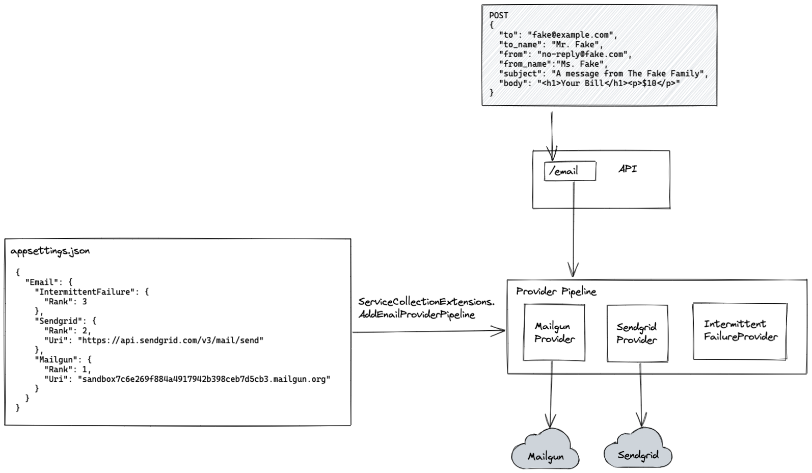

# Rupa Email Service

This project is my attempt to tackle the problem of providing a Transactional Email Service - a.k.a. a service that abstracts multiple email "providers" and allows for easy failovers between providers.

## Installation Instructions

1. Clone the repo locally
2. Configure the `appsettings` files based on your preferred ranking of different email providers
3. Set environment variables for your API keys - `Email__Sengrid__ApiKey` for Sendgrid and `Email__Mailgun__ApiKey`
4. Run the service using `dotnet run --project EmailService` from the directory that contains the `.sln` file

## Architecture Overview

Some of my goals when approaching this exercise were:
1. Make everything configurable from a simple config file
2. Automatically fail over to another mail provider when errors are detected
3. Periodically try to send messages with failed providers in an attempt to "self-heal"

Here's a high-level architecture diagram:

The main service that handles the sending of emails is the `EmailProviderPipeline`, which abstracts a "chain of responsibility" of email providers. This pipeline contains a list of providers, the presence and order of which depend on the `appsettings.json` config file. These providers are what ultimately send the email to services like Sendgrid or Mailgun.

The provider logic is executed under a "CircuitBreaker" policy (provided by the Polly library), which abstracts the concept of counting exceptions until a threshold is reached, at which point the "circuit" is broken and the provider is disabled for some configurable amount of time. After that length of time has passed, the provider is once again "eligible", but a single exception will send it back to the disabled state.

## Language and Library Choices

For this project, I chose C# and the .NET framework, with some additional libraries. This is because I am currently most comfortable with these technologies, and when thinking about the failover aspect, the fantastic C# resilience library Polly immediately came to mind. This package provides the Circuit Breaker pattern that allows us to retry a provider a number of times before automatically moving to the next highest preferred provider with no downtime.

The only other library I used was RestSharp, which is a C# HTTP client library that was used in the Mailgun docs. I don't think this is necessary and I would try to avoid this in a real project, but I was having issues getting the built in HTTP client to work in the limited time that I had.

## Tradeoffs/Do Differently

For this project, I added more complexity than the initial prompt was asking for, but in return gained the ability to register provider preference just by modifying the configuration file and being able to fail over to a new provider without any downtime or manual intervention from engineering.

I tried to place logging in the expected places - if this were a real application, I would log to an external service such as Kibana and build alerting around when certain providers are failing.

Additionally, given more time I would have added more tests and tried to package the application in a Dockerfile for easy deployments via docker-compose or Kubernetes. The tests I did add test the main flow of "what happens when the preferred mail provider fails?"

Certain files are in need of cleanup, most obviously the `ServiceCollectionExtensions.cs` file, which contains the logic for configuring the options from the appsettings file as well as registering services with the DI container based on the contents of the configuration file.

## Time Spent

I spent somewhere in the neighborhood of five to six hours on this project.
